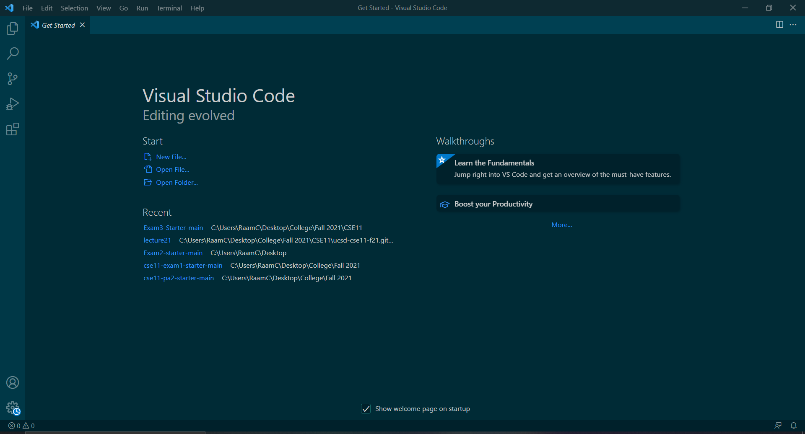
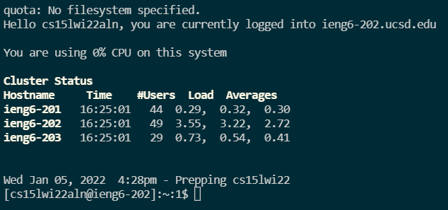
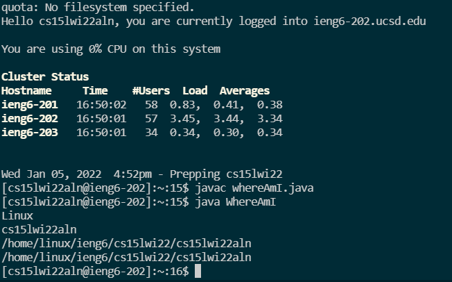
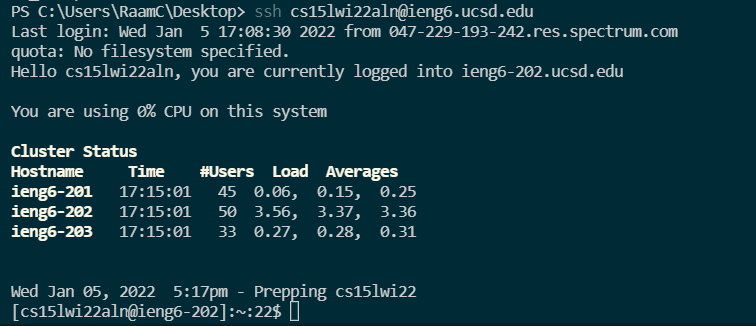

# Week 2 Lab Report: Remote Access

## 1). Installing VScode

The first step for setting up remote access is downloading a code editor. VScode can be downloaded from this link: [https://code.visualstudio.com/](https://code.visualstudio.com/).

Once you have it installed, the home page should look something like this (minus the theme and my recent projects).


## 2). Remotely Connecting
* Before you can connect remotely, you need to have OpenSSH client and OpenSSH server installed, both of which can be installed by following the directions from this link: [https://docs.microsoft.com/en-us/windows-server/administration/openssh/openssh_install_firstuse](https://docs.microsoft.com/en-us/windows-server/administration/openssh/openssh_install_firstuse).
* Then you need to use the account lookup tool to find your login information from this link: [https://sdacs.ucsd.edu/~icc/index.php](https://sdacs.ucsd.edu/~icc/index.php).
* Open up a new terminal in VScode from the top of the screen (ctrl + shift + \`) and type in the following command with your course-specific letters replacing the 'zz':
`$ ssh cs15lwi22zz@ieng6.ucsd.edu`
* Enter 'yes' if it asks you if you want to continue connecting and then enter your account password. It should look something like this once you are connected.


## 3). Trying Some Commands
Here are some helpful commands:
* `cd ~` (changes the current directory)
* `cd` (takes you back to the home directory)
* `ls` (lists the files in the current directory)
* `ls -l` (lists the files in the current directory with some additional info)
* `ls -a` (lists the files in the current directory including hidden files)
* `ls -lat` (combination of the previous two commands)
* `pwd` (gives the absolute path of the current directory)
* `mkdir` (creates a new folder in the current directory)
* `open ~` (opens the file)
* `du` (gets the size of files and folders in the directory)
* `exit` (logs out of the remote server, can also use ctrl + D)

## 4). Moving Files With scp

The `scp` command is used to move files from the client to the remote server.
* The format is `scp filename cs15lwi22zz@ieng6.ucsd.edu:~/` where filename is the name of the file
* Enter your password to log in and you should be able to see the file in the remote server with the `ls` command. 
Here is an example of me running code on the remove server after using `scp` to copy it over: 

## 5). Setting an SSH Key

To make it so that you don't need to enter your password every time you want to log into the remote server, you can set an SSH key.
* First, run the `ssh-keygen` command on your computer
* Press enter twice if prompted to set a passphrase to leave it empty
* Copy the public key that was generated to the `.ssh` directory on the server, replacing the YOURUSER with the name of your user on your device and using the appropriate letters in place of the 'zz':

```
$ ssh cs15lwi22zz@ieng6.ucsd.edu
<Enter Password>
$ mkdir .ssh
$ exit
$ scp /Users/YOURUSER/.ssh/id_rsa.pub cs15lwi22zz@ieng6.ucsd.edu:~/.ssh/authorized_keys
```
You should now be able to use the `ssh` and `scp` commands without entering your password every time. When you `ssh`, it should look something like this:


## 6). Optimizing Remote Running

* To log out of the server after running a command, you can put quotes around it like so, where COMMAND is the command you want to run on the remote server: `ssh cs15lwi22@ieng6.ucsd.edu "COMMAND"`
* By separating commands with semicolons, you can run multiple commands on the server with one line of code: `$ scp file.java cs15lwi22zz@ieng6.ucsd.edu; ssh cs15lwi22zz@ieng6.ucsd.edu "javac file.java; ssh cs15lwi22zz@ieng6.ucsd.edu "java file"`