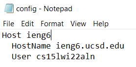
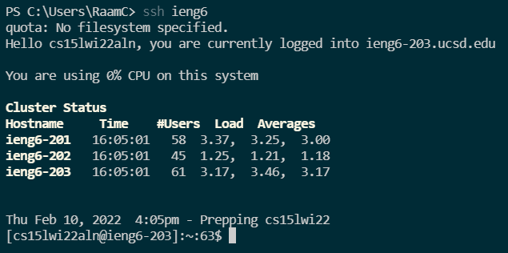
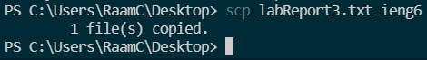

# Week 6 Lab Report: Streamline ssh Configuration

## 1). Modify .ssh/config File

First, I found my config file on my system and edited the host to simply be 'ieng6' using notepad. The image below shows the contents of my updated config file.

## 2). Attempting to ssh

After editing the config file, I could now ssh into my account by simply using the command `ssh ieng6`, as seen below. This makes it a lot easier to use my student account because now I don't need to remember the entire login.

## 3). Attempting to scp

I can now also use the shortened login name when scping files over, with the format `scp (file) ieng6`, as seen below. This also makes it easier to transfer files between my local machine and the student account.

