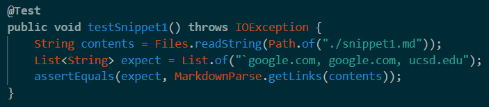
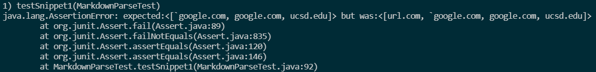
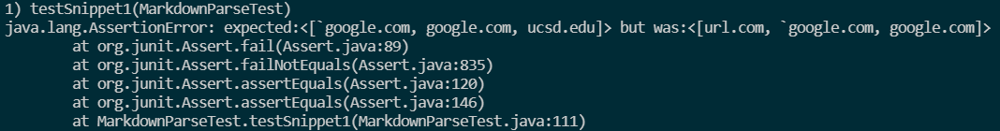
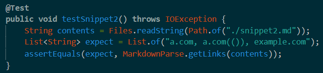
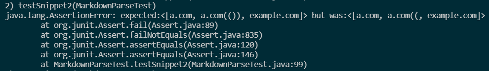
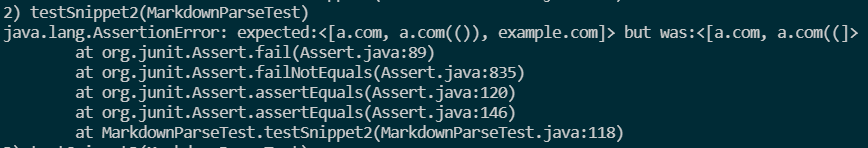
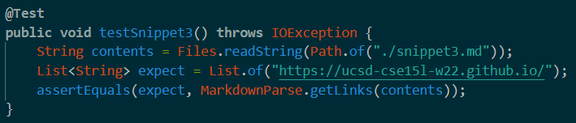
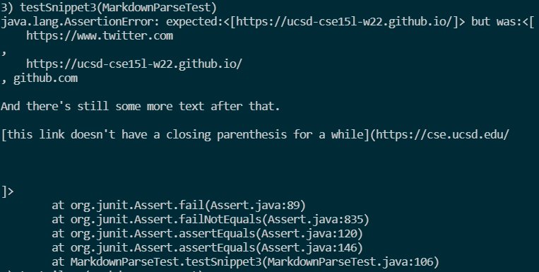
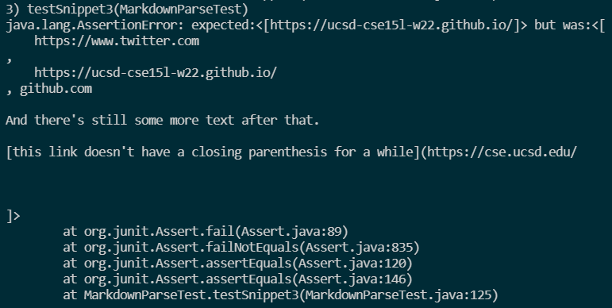

# Week 8 Lab Report: MarkdownParse Snippets

[A link to my MarkdownParse](https://github.com/rchaklas/markdown-parse)

[A link to the other group's MarkdownParse](https://github.com/rchaklas/markdown-parse)

## 1). Snippet 1

The first snippet should produce `[google.com]` as its output. Below is the code used to test the first snippet for both implementations:

Here is the output of my MarkdownParse failing the first test:

Here is the output of the other group's MarkdownParse failing the first test:

I think there is a small change that could be made to fix my implementation failing this snippet. It would involve checking the string between `nextOpenBracket` and `nextCloseBracket` for backticks and other similar characters with `indexOf` and setting `currentIndex` to the index after the character if such a character is found. 

## 2). Snippet 2

The second snippet should produce `[a.com, a.com(()), example.com]` as its output. Below is the code used to test the second snippet for both implementations:

Here is the output of my MarkdownParse failing the second test:

Here is the output of the other group's MarkdownParse failing the second test:

I do not think there is a small change that could be made to fix the issue with multiple closed parenthesis in the link. This is because the program stops at the first closed parenthesis and it would involve a lot of code to find the last closed parenthesis, such as creating a stack at the first open parerenthesis to find the correct closed parenthesis.

## 3). Snippet 3

The third snippet should produce `[https://ucsd-cse15l-w22.github.io/]` as its output. Below is the code used to test the third snippet for both implementations:

Here is the output of my MarkdownParse failing the third test:

Here is the output of the other group's MarkdownParse failing the third test:

I do think there is a small change that could be made to fix the issue with new lines between the brackets and parenthesis. The fix would be similar to the one for snippet 1, but would involve searching the string for spaces and new lines ('\n') using the `indexOf` method. If found, `currentIndex` would be updated appropriately and the program would continue searching.