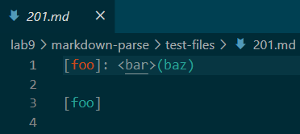
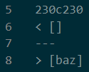
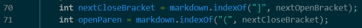
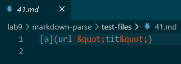
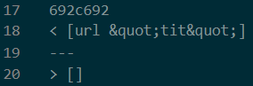
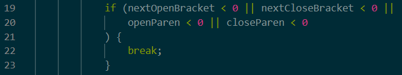

# Week 10 Lab Report: Markdown-Parse Implementation Differences

These tests were found by using `diff` on my markdownparse implementation and the other implementation and storing the results in a text file. The results were then manually inspected to identify two tests with differing results. I also looked at the test files themselves to make sure both tests were caused by different bugs. The text file containing the results of using `diff` has the line numbers that correspond to the lines in the individual result files for both implementations, which has the name of the specific file, which is how I identified them.

## 1). Test File 201.md

For this test, my implementation is correct. The expected output is `[]` as determined by commonmark, and you can see the output of my implementation vs the other implementation below (mine is on top, the other is on the bottom):

The problem with the other implementation is that it doesn't take into account the `<` sign and thinks it is still a link, which it shouldn't be. After the assignment of `nextCloseBracket` and `openParen` in the `getLinks` method, it should check for special characters between `nextCloseBracket` and `openParen`, so after the code shown below:

## 2). Test File 41.md

For this test, the other implementation is correct. The expected output is `[]` as determined by commonmark, and you can see the output of my implementation vs. the other implementation below (mine is on top, the other is on the bottom):

The problem with my implementation is that it doesn't check for special characters between `openParen` and `closeParen`. This causes it to register "links" with spaces in them as a proper link, which it should not. The code that should be fixed is adding code that checks for spaces and other special characters within `openParen` and `closeParen` after checking if any of the parameters are negative in the `getLinks` method, so after the code shown below:

